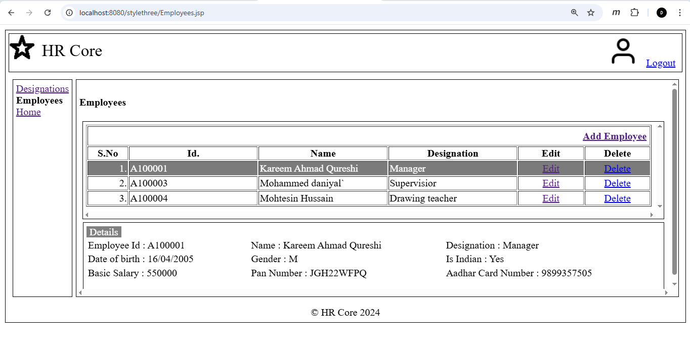

# The Evolution of Web Architecture: A Comparative Study

This repository contains the same CRUD application implemented five times using different architectural approaches.
The goal is to show how web architecture evolved and what problem each approach was designed to solve.

---

## Architectural Comparison

| Stage                                 | Pattern                      | What changes                                            | Why it matters                                          |
| ------------------------------------- | ---------------------------- | ------------------------------------------------------- | ------------------------------------------------------- |
| **[01](./stage-1-servlet/)**          | Imperative Servlet           | HTML generated using `PrintWriter`                      | Understand raw HTTP lifecycle and server-side rendering |
| **[02](./stage-2-jsp-mvc/)**          | MVC (JSP + Beans)            | View separated from business logic                      | Cleaner structure and maintainability                   |
| **[03](./stage-3-ajax-json/)**        | AJAX + JSON                  | UI rendered in browser, server returns data             | Decoupled frontend and backend                          |
| **[04](./stage-4-springboot/)**       | Spring Boot                  | Framework handles routing and boilerplate               | Faster development through abstraction                  |
| **[05](./stage-5-custom-framework/)** | Custom lightweight framework | Spring responsibilities replaced with custom dispatcher | Understanding framework concepts internally             |

---

## Same UI Across All Stages

The database schema, user interface, and business operations remain the same in every stage.
Only the data flow and backend structure change.

---

## Purpose

This project focuses on understanding why different web development approaches exist, not just how to use them.

---
