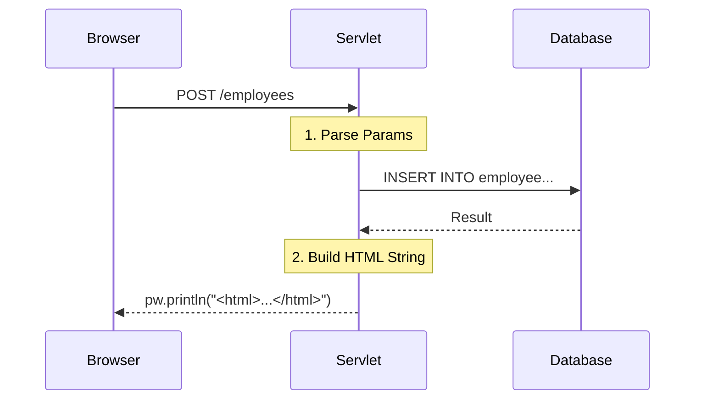

# Stage 1: The "God Class" (Raw Servlets)

> **Architecture:** Monolithic Servlet
> **Rendering:** Server-Side Hardcoded HTML
> **Tooling:** Custom CLI for HTML-to-Java generation

## Concept
In this stage, I built the entire CRUD application using only **Servlets** and **JDBC**. There is no separation of concerns: the Servlet parses the request, connects to the database, and constructs the HTML response manually.

## Request Flow
The Servlet acts as a bottleneck for both logic and UI.



## The Problem: "String Hell"

Writing HTML inside Java Strings is error-prone. You lose syntax highlighting, and you have to manually escape every double quote (`"`) with a backslash (`\"`).

*The horror of manual coding:*

```java
// One typo here breaks the whole page
pw.println("<input type=\"text\" name=\"salary\" value=\"" + salary + "\">");

```


##  The Solution: `PWPrintln` Automation Tool
I realized that typing `pw.println` for hundreds of lines of HTML was inefficient and error-prone. So, I wrote a custom Java CLI tool to automate the conversion.

### Automation Workflow
1.  **Input:** I write standard HTML in a file (e.g., `Employees.html`).
2.  **Process:** The tool reads the file, escapes the quotes (`"` → `\"`), and wraps lines in `pw.println()`.
3.  **Output:** It generates a `tmp.tmp` file containing the Java code, which I paste into the Servlet.

*Command:*
```bash
# Running the tool with manual classpath configuration
java -classpath dist/tmcommon.jar;. com.thinking.machines.util.PWPrintln Employees.html

```

*Tool Logic (Snippet):*

```java
// Automating the escaping process
while(randomAccessFile.getFilePointer() < randomAccessFile.length()) {
    line = randomAccessFile.readLine();
    line = line.replaceAll("\"", "\\\\\""); // Escape double quotes
    tmpRandomAccessFile.writeBytes("pw.println(\"" + line + "\");\r\n");
}

```

### Dynamic Data Injection

The tool generates the static HTML structure. I then manually injected the data loops where dynamic content (from the Database) was needed.

*Refactored Loop in `EmployeesView.java`:*

```java
// Injecting dynamic data into the generated structure
for(EmployeeDTO employeeDTO : employees) {
    pw.println("var employee = new Employee();");
    pw.println("employee.employeeId = \"" + employeeDTO.getEmployeeId() + "\";");
    pw.println("employee.name = \"" + employeeDTO.getName() + "\";");
    
    // Manual handling of data types
    pw.println("employee.basicSalary = " + employeeDTO.getBasicSalary().toPlainString() + ";");
    
    pw.println("employees[" + i + "] = employee;");
    i++;
}

```

> **Note:** This highlights the fragility of this stage. I was effectively writing JavaScript code *inside* Java Strings.

---

## Architectural Analysis

| Dimension | Rating | Reason |
| --- | --- | --- |
| **Performance** | High | No framework overhead; closest to the metal. |
| **Dev Experience** | Low | Requires custom tooling just to write HTML efficiently. |
| **Maintainability** | Low | UI changes require re-running the tool and re-compiling Java. |

---

## Evolution

Even with the automation tool, maintaining this codebase was difficult. If the frontend changed, I had to regenerate the code and re-inject the variables manually.

To solve this, I moved to **JSP (JavaServer Pages)** in the next stage to separate the HTML from the Java code.

**[Next: Stage 2 (JSP & Custom Tags)](../stage-2-jsp-mvc/)**
