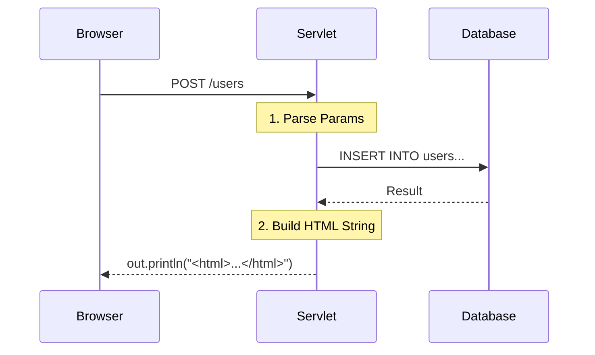

#  Stage 1: The "God Class" (Raw Servlets)

> **Architecture:** Monolithic Servlet
> **Rendering:** Server-Side Hardcoded HTML

###  The Architectural Concept
In the early days of Java web development, there was no separation of concerns. The Servlet was responsible for **everything**:
1.  Parsing the HTTP Request.
2.  Connecting to the Database (JDBC).
3.  Constructing the HTML Response string line-by-line.

###  Request Flow
Note how the Servlet acts as a bottleneck for both logic and UI.



###  The "Pain Point" (Why this implies bad architecture)

This approach requires mixing Java logic with HTML strings. This makes the code **illegible** and **untestable**.

*Look at this snippet from the codebase:*

```java
// ❌ The Maintenance Nightmare
PrintWriter out = response.getWriter();
out.println("<html><body>");
out.println("<h1>User: " + user.getName() + "</h1>"); 
out.println("<div style='color:red'>" + user.getStatus() + "</div>");
out.println("</body></html>");

```

*If the frontend team wants to change a `div` to a `span`, the backend engineer has to recompile the Java code.*

###  Architectural Analysis

| Dimension | Rating | Reason |
| --- | --- | --- |
| **Performance** |  High | No framework overhead; closest to the metal. |
| **Maintainability** |  Low | UI changes require Backend deploys. |
| **Scalability** |  Low | logic is tightly coupled; cannot split teams. |

---

###  Evolution: Why move to Stage 2?

To stop hardcoding HTML in Java, we need a technology that allows us to write HTML normally and "inject" data into it.

**[Go to Stage 2: Introducing JSP & MVC](../stage-2-jsp-mvc/)**


