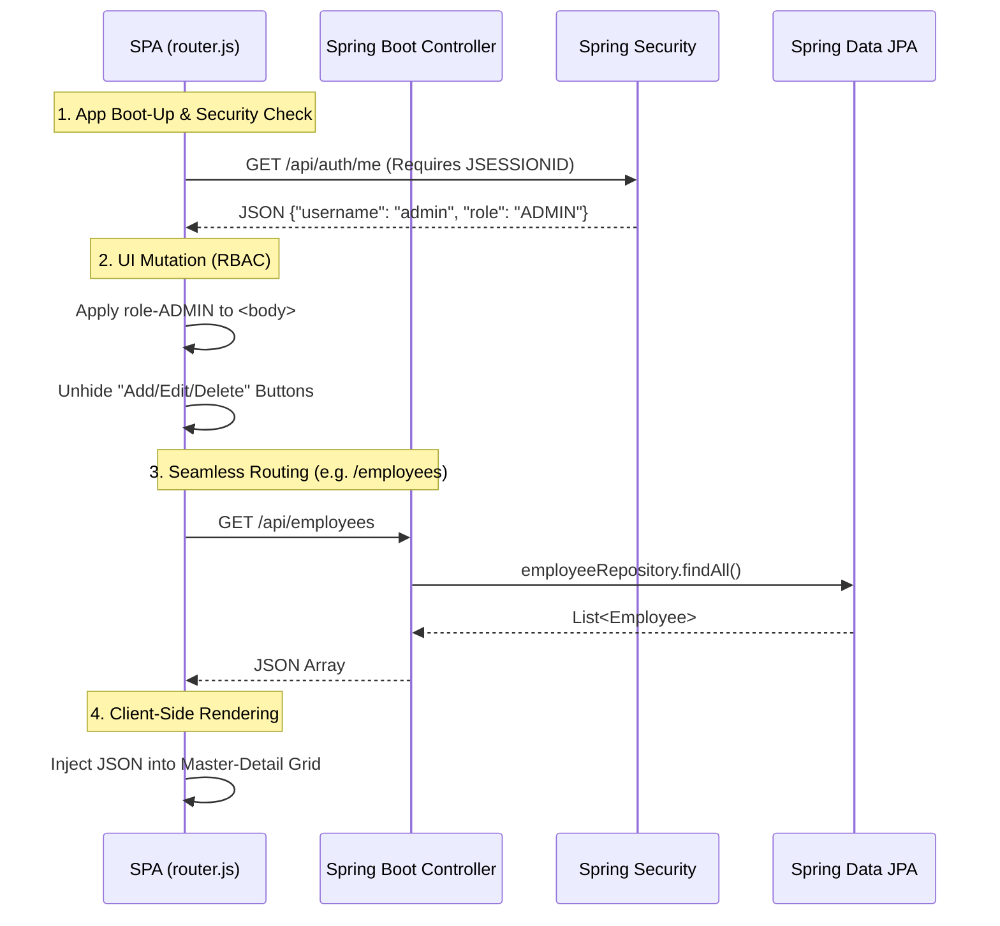

# Stage 4: Spring Boot & Single Page Application (SPA)

> **Architecture:** RESTful API + Decoupled SPA
> **Rendering:** Client-Side Routing (Vanilla JavaScript)
> **Security:** Spring Security (JSESSIONID) with Role-Based Access Control (RBAC)

## Concept

In Stage 3, I achieved a stateless, seamless user experience using AJAX, but the backend was still bogged down by manual JDBC plumbing and JSON conversion.

In Stage 4, I adopted **Spring Boot** to eliminate backend boilerplate, and upgraded the frontend into a true **Single Page Application (SPA)**. Furthermore, I introduced enterprise-grade security using **Spring Security**, implementing Role-Based Access Control (RBAC) where the UI dynamically adapts based on the logged-in user's privileges.

## Request Flow: The Decoupled SPA

Unlike previous stages where the server was concerned with the UI, the backend is now a pure REST API. The frontend uses a custom JavaScript router to intercept URL changes, fetch raw data, and paint the DOM independently.



## The Problem: "Boilerplate & Routing Hell"

Stage 3 proved that AJAX provides a better User Experience, but the **Developer Experience** was terrible:

1. **JDBC Boilerplate:** Writing `ResultSet` mappers and `PreparedStatement` strings for every CRUD operation was repetitive and prone to SQL injection risks if mishandled.
2. **Clunky Navigation:** Changing views in Stage 3 meant manually hiding and showing HTML `<div>` elements. If the user clicked the browser's "Back" button, the application would break.

## The Solution: Spring Ecosystem & Vanilla Router

### 1. Spring Data JPA (The ORM Layer)

I replaced hundreds of lines of raw JDBC connection code with **Hibernate/JPA**. By simply declaring interfaces, Spring generates the SQL at runtime.

*Refactored Data Access Layer:*

```java
// Spring Boot completely auto-generates the CRUD implementations!
public interface EmployeeRepository extends JpaRepository<Employee, String> {
    // Custom query methods can be created just by naming them correctly
    boolean existsByPanNumber(String panNumber);
}

```

### 2. The Vanilla JS Router (`router.js`)

Instead of serving multiple `.jsp` or `.html` files, the application loads a single `index.html` shell. I built a custom frontend router that leverages the browser's History API (`window.history.pushState`).

* When a user navigates to `/employees`, the page doesn't reload.
* The router intercepts the request, dynamically fetches the `employees.html` component, and injects it into the main content area.
* The browser's "Back" and "Forward" buttons work flawlessly without ever querying the server for HTML.

### 3. Full-Stack Role-Based Access Control (RBAC)

I replaced the manual `HttpSession` checks from Stage 2 and 3 with **Spring Security**. Security is now enforced across multiple layers:

* **The API Vault:** Endpoints are strictly protected in `SecurityConfig.java`. Unauthenticated requests are intercepted and redirected to a custom `/login` form via a 302 redirect.
* **The Dynamic UI:** The frontend router fetches the user's role on boot-up and physically alters the DOM.
* **The Route Bouncer:** If a standard `USER` manually types `/employees/add` into the address bar, the custom `router.js` intercepts the request and blocks the view from loading.

## Architectural Analysis

| Dimension | Rating | Reason |
| --- | --- | --- |
| **Dev Velocity** | High | Framework abstractions (JPA, RestController) eliminate repetitive coding. |
| **Maintainability** | High | Strict N-Tier architecture. The frontend and backend are completely decoupled. |
| **Security** | High | Enterprise-grade session management (JSESSIONID) and layered RBAC. |
| **Scalability** | High | The backend REST API could easily support a mobile app without any code changes. |

## Evolution

This marks the final, production-ready stage of the Web CRUD Architecture Evolution.

By progressing from a tightly-coupled, monolithic Servlet (Stage 1) to a fully decoupled, secure SPA (Stage 4), this project successfully demonstrates how modern frameworks solve historical engineering bottlenecks regarding scalability, security, and separation of concerns.
